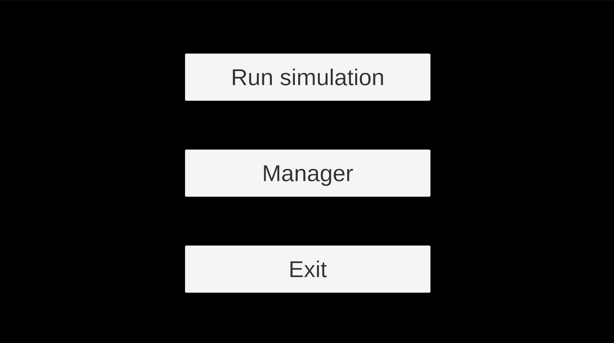
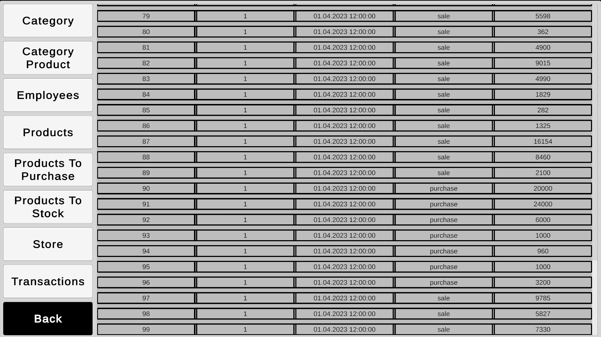

# Store Simulation

Eng | [Rus](resources/localization_readme/README_RU.md)

## Description

This is a primitive simulation of a store's operation. Periodically, customers appear in the store who walk around collecting purchases, then go to the checkout and make purchases before leaving the store. The project is connected to a database; all goods are stored in the database, transactions, and other data are also recorded and read from the database. There is also a manager mode where you can view data from the database.

## Running the Simulation

It can be launched using the compiled build located in [Releases](https://github.com/ShutovKS/Store-Simulation/releases) or by cloning and running the project through Unity.

## Author

### Author and Developer

- Kirill Shutov (ShutovKS), Russia

## License

```text
MIT License
```

## Screenshots






