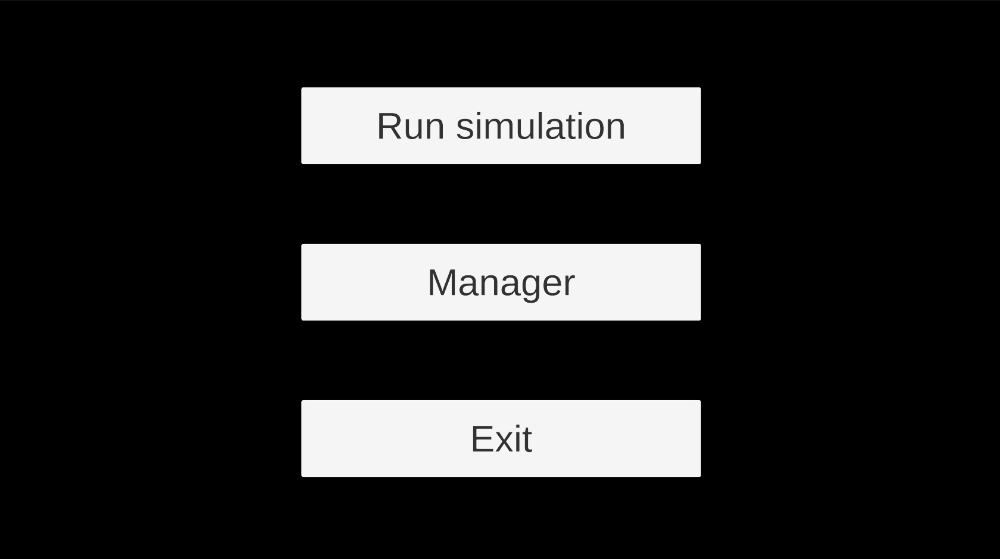
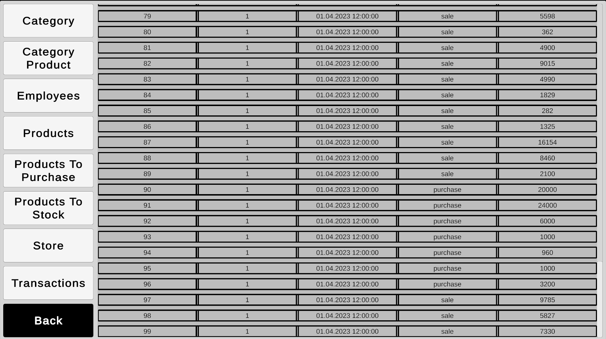
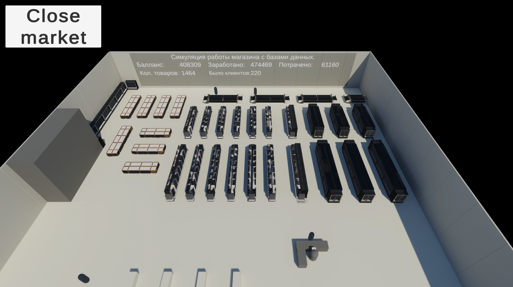

# Симуляция магазина

Rus | [Eng](../../README.md)

## Описание

Это примитивная симуляция работы магазина. Периодически в магазине появляются покупатели которые ходят по магазину собирая покупки, после чего отправляются на кассу и совершают покупки и покидают магазин. К проекту подключена база данных, все товары хранятся в базе данных, транзакции и остальные данные также записываются и считываются из базы данных. Также есть режим менеджера, где можно просматривать данные из базы данных.

## Запуск симуляции

Запустить можно при помощи собранной сборки которая находится в [Releases](https://github.com/ShutovKS/Store-Simulation/releases) или клонировав и запустив проект через Unity.

## Автор

### Автор и разработчик

* Кирилл Шутов (ShutovKS), Россия

## Лицензия

``` text
MIT Лицензия
```

## Скриншоты






